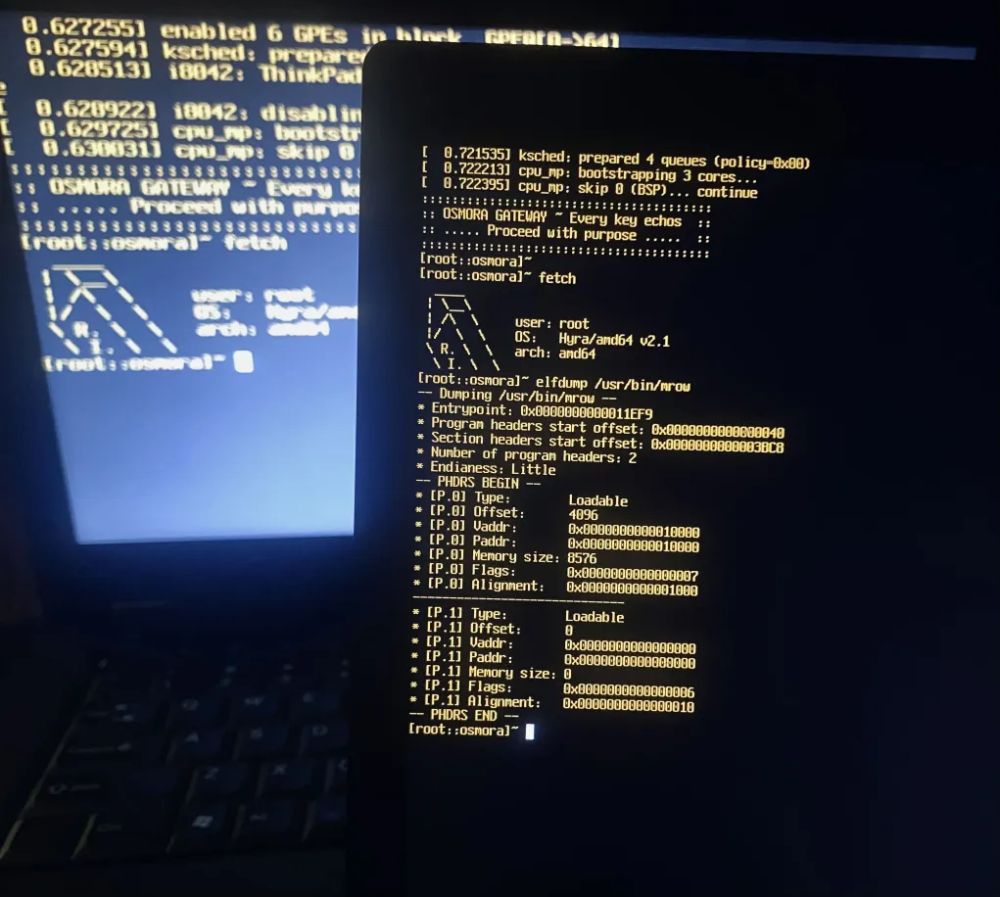

The Hyra Operating System
=========================

Welcome to the Hyra Operating System project! Hyra is an experimental
operating system inspired by BSD and Plan 9 while being entirely written
entirely from scratch. Hyra aims to rethink core fundamentals in modern operating system design
in order to create new and improved architectural ideas.

Project Goal:
--------------
The goal of this project is to redefine what modern operating systems are while taking inspiration from BSD. Hyra does
not use CPIO for its initramfs like other operating systems typically would and instead uses the [OSMORA Archive Format (OMAR)](https://osmora.org/oap/oap-0005).

What Hyra is NOT:
--------------
Hyra is *NOT* Linux, nor does extend or share any sources with any existing
operating systems as it is written entirely from scratch. Hyra is *NOT* intended as a "toy" project as it is aimed to be the used as the main operating system for internal OSMORA operations and infrastructure.

Getting Started:
----------------
To build Hyra you'll need to bootstrap the project which is essentially just fetching dependencies for the project. This can be done by running the bootstrap script within the project root: `./bootstrap`.

Next, to configure for x86_64 just run configure:

`./configure`

After running the configure script, you can now actually build Hyra:

`./hyra-build.sh`

This will generate a new `Hyra.iso` file.

Default User:
----------------
Upon booting, the `login` program will ask for user credentials. The default username is `root` and the default
password is also `root`.

Programs:
----------------
The Hyra userspace provides the user various programs that they can run. Examples of
such programs include:

- ``beep`` - Play a tone
- ``cat`` - Print files to stdout
- ``date`` - Get the current date or set system time
- ``echo`` - Print a line of text
- ``elfdump`` - Get information about an ELF binary
- ``fetch`` - System fetch! A must have :~)
- ``getconf`` - Get system configuration values
- ``mex`` - OSMORA hexdump utility
- ``sleep`` - Sleep for a number of seconds
- ``kmsg`` - Read the kernel message buffer
- ``readcore`` - Read coredump files
- ``oasm`` - OSMORA [OSMX64](https://github.com/sigsegv7/OSMX64) Assembler
- ``oemu`` - OSMORA [OSMX64](https://github.com/sigsegv7/OSMX64) Emulator
- ``kstat`` - Read kernel statistics
- ``dmidump`` - Dump DMI/SMBios information

And more! See ``usr.bin/*``

Libraries:
----------------
The Hyra userspace additionally provides the user various libraries that they can
link with. Examples of such libraries include:

- ``libc`` - C library (link flag: ``-lc``)
- ``libgfx`` - Low-level graphics (link flag: ``-lgfx``)

And more! See ``lib/*``

Documentation:
--------------
Documentation will be in the form of comments throughout the codebase and can also be found in the share/ directory within the project root.

Hyra running on bare metal:
--------------

License:
--------
This project is licensed under the BSD-3 clause (SPDX Identifier: BSD-3-Clause)
